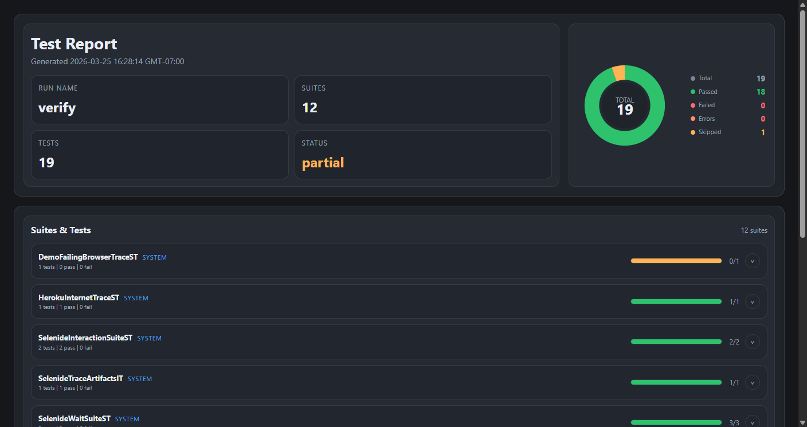
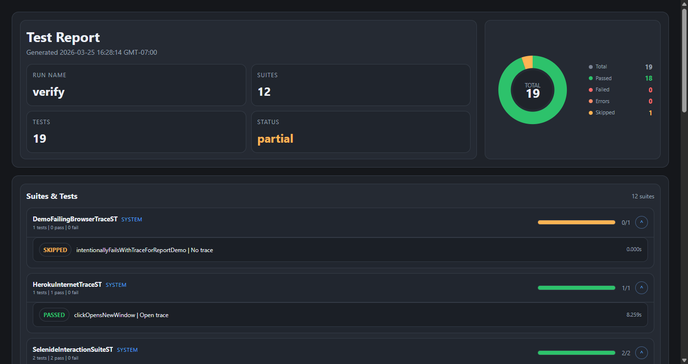
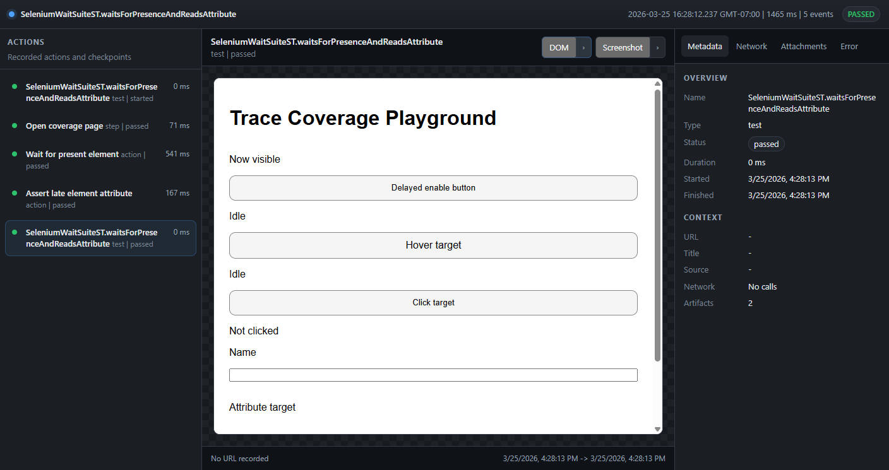
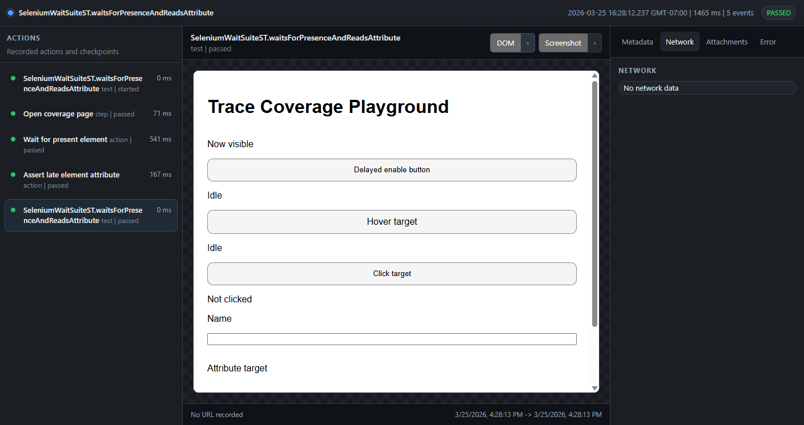

# selenium-tracing

Playwright-style local traces for Java UI tests built on top of Selenide and plain Selenium.

The project generates per-test trace artifacts, a browser-friendly trace viewer, and a combined HTML test report that links each traced test directly to its captured run.

## What It Captures

- step timeline with pass/fail state and timings
- DOM snapshots rendered in the viewer
- screenshots for every recorded event
- element targeting markers for actions, waits, queries, and assertions
- browser, driver, and performance logs when the browser exposes them
- network calls with URL, path, method, status, headers, timing, size, request/response body previews, and full body attachments when available
- zipped trace bundles under `target/selenide-traces`

## Screenshots

### Test Report





### Trace Viewer





## Maven Coordinates

```xml
<dependency>
  <groupId>dev.codex</groupId>
  <artifactId>selenide-tracing</artifactId>
  <version>1.0-SNAPSHOT</version>
</dependency>
```

## Selenide Usage

Register the JUnit 5 extension to start and stop tracing automatically for each test.

```java
import static com.codeborne.selenide.Condition.visible;
import static com.codeborne.selenide.Selenide.$;
import static com.codeborne.selenide.Selenide.open;

import dev.codex.tracing.SelenideTrace;
import dev.codex.tracing.SelenideTraceExtension;
import org.junit.jupiter.api.Test;
import org.junit.jupiter.api.extension.RegisterExtension;

class LoginTest {
  @RegisterExtension
  static final SelenideTraceExtension trace = new SelenideTraceExtension();

  @Test
  void login() {
    SelenideTrace.step("Open login page", () -> open("https://example.com/login"));
    SelenideTrace.step("Submit credentials", () -> {
      $("#email").setValue("user@example.com");
      $("#password").setValue("secret");
      $("button[type='submit']").click();
    });
    SelenideTrace.step("Assert user is signed in", () -> $(".profile").shouldBe(visible));
  }
}
```

## Traced ChromeDriver Usage

Use `TracingSelenideChromeDriver` as the only Selenium-side API. It is a traced drop-in `ChromeDriver`.

```java
import dev.codex.tracing.TracingSelenideChromeDriver;
import org.junit.jupiter.api.Test;
import org.openqa.selenium.By;
import org.openqa.selenium.WebElement;

class SeleniumLoginTest {
  @Test
  void login() {
    TracingSelenideChromeDriver driver = new TracingSelenideChromeDriver("SeleniumLoginTest.login");
    try {
      driver.get("https://example.com/login");

      WebElement email = driver.findElement(By.id("email"));
      email.sendKeys("user@example.com");

      WebElement submit = driver.findElement(By.cssSelector("button[type='submit']"));
      submit.click();

      String heading = driver.findElement(By.tagName("h1")).getText();

      if (!heading.contains("Dashboard")) {
        throw new AssertionError("Expected dashboard heading");
      }
    } catch (Throwable throwable) {
      driver.stopTraceFailed(throwable);
      throw throwable;
    } finally {
      driver.quit();
    }
  }
}
```

Direct calls like `get`, `findElement`, `findElements`, `click`, `sendKeys`, `getText`, `getAttribute`, navigation, and window switching are traced automatically.

## Selenide + Traced Driver

You can also run Selenide on top of the same traced driver instance.

```java
import static com.codeborne.selenide.Condition.exactText;
import static com.codeborne.selenide.Condition.visible;
import static com.codeborne.selenide.Selenide.$;
import static com.codeborne.selenide.Selenide.open;

import com.codeborne.selenide.WebDriverRunner;
import dev.codex.tracing.TracingSelenideChromeDriver;
import org.junit.jupiter.api.Test;

class SelenideWithTracingDriverTest {
  @Test
  void flow() {
    TracingSelenideChromeDriver driver =
        new TracingSelenideChromeDriver("SelenideWithTracingDriverTest.flow");
    try {
      open("https://the-internet.herokuapp.com/windows", driver);

      $("h3").shouldHave(exactText("Opening a new window"));
      $("a[href='/windows/new']").click();

      driver.switchTo().window(driver.getWindowHandles().stream().skip(1).findFirst().orElseThrow());

      $("h3").shouldBe(visible).shouldHave(exactText("New Window"));
      WebDriverRunner.closeWebDriver();
    } catch (Throwable throwable) {
      driver.stopTraceFailed(throwable);
      throw throwable;
    } finally {
      driver.quit();
    }
  }
}
```

## Trace Output

Each traced test creates a directory under `target/selenide-traces/<test-name>-<timestamp>` with:

- `trace.trace`: JSONL event stream
- `index.html`: standalone local trace viewer
- `resources/`: screenshots, HTML snapshots, network payloads, and logs
- `<trace>.zip`: zipped artifact bundle

The viewer includes:

- timeline navigation on the left
- DOM and screenshot preview in the center
- action metadata, attachments, logs, and network inspection on the right

## Combined HTML Test Report

Running `verify` also generates a consolidated report at `target/test-report/index.html`.

It includes:

- run summary and pie chart
- expandable suite list
- per-test result badges and durations
- direct links from traced tests into their trace viewer

## Configuration

Use `SelenideTraceConfig` when you need to change output location or reduce capture volume.

```java
import dev.codex.tracing.SelenideTraceConfig;
import dev.codex.tracing.SelenideTraceExtension;
import java.nio.file.Path;

SelenideTraceConfig config = SelenideTraceConfig.builder()
    .outputRoot(Path.of("build", "custom-traces"))
    .captureScreenshotsOnEveryEvent(true)
    .captureDomOnEveryEvent(true)
    .captureBrowserLogsOnFinish(true)
    .build();

SelenideTraceExtension trace = new SelenideTraceExtension(config);
```

## Test Suites

The project uses three layers of automated tests.

- `*Test.java`: unit tests via Surefire
- `*IT.java`: integration tests via Failsafe
- `*ST.java`: browser-backed system tests via Failsafe when `-DrunSystemTests=true`

Useful commands:

```bash
mvn test
mvn verify
mvn verify -DrunSystemTests=true
```

Current browser coverage includes at least one traced case for:

- click
- typing
- hover
- `getText`
- `getAttribute`
- single-element lookup
- multi-element lookup
- visibility waits
- enabled waits
- presence waits
- assertions in both Selenide and plain Selenium flows

## GitHub Actions And Publishing

Included workflows:

- CI: `.github/workflows/ci.yml`
- publishing to GitHub Packages and Maven Central: `.github/workflows/publish.yml`

Repository variables expected by the publish workflow:

- `PUBLISHER_ID`
- `PUBLISHER_NAME`
- `PUBLISHER_EMAIL`

Repository secrets expected by the Maven Central job:

- `CENTRAL_TOKEN_USERNAME`
- `CENTRAL_TOKEN_PASSWORD`
- `GPG_PRIVATE_KEY`
- `GPG_PASSPHRASE`

## Notes

- Trace sessions are isolated per test via thread-local state.
- Network capture currently uses Chrome performance logs, so it is close in spirit to Playwright traces but not a byte-for-byte implementation of Playwright's internal snapshot model.
- Pages with aggressive CSP, authenticated assets, or heavy runtime JavaScript can still render differently in local HTML snapshot playback.
